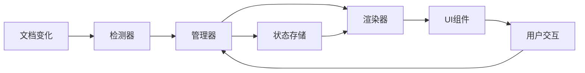

# 多行 Block 功能重新设计与实现计划

## 一、总体设计原则

### 1.1 核心目标
- 建立一个清晰、可维护的架构
- 避免原有设计中的状态管理混乱问题
- 确保 Live Preview 和 Reading 模式的行为一致性
- 逐步实现，每一步都可测试和验证

### 1.2 设计理念
- **渐进式开发**：从最基础的功能开始，逐步添加复杂性
- **统一架构**：使用统一的渲染管道，避免多套独立系统
- **清晰的职责分离**：每个模块有明确的单一职责
- **状态集中管理**：避免状态分散在多个地方

## 二、分阶段实现计划

### 第一阶段：基础架构搭建（1-2天）

#### 1.1 创建统一的多行 Block 管理器
```typescript
// src/features/multiline-block/MultilineBlockManager.ts
class MultilineBlockManager {
  private static instance: MultilineBlockManager;
  private blocks: Map<string, MultilineBlockData>;
  private renderers: Map<RenderMode, IMultilineBlockRenderer>;
  
  // 单例模式
  public static getInstance(): MultilineBlockManager
  
  // 核心 API
  public registerBlock(data: MultilineBlockData): void
  public updateBlock(id: string, changes: Partial<MultilineBlockData>): void
  public getBlock(id: string): MultilineBlockData | undefined
  public detectMultilineBlock(text: string): boolean
}
```

#### 1.2 定义标准数据模型
```typescript
// src/features/multiline-block/types.ts
interface MultilineBlockData {
  id: string;              // 格式: "xyz-xyz"
  filePath: string;        // 源文件路径
  startLine: number;       // 起始行号
  endLine: number;         // 结束行号
  startMarker: string;     // ^xyz
  endMarker: string;       // ^xyz-xyz
  state: {
    isExpanded: boolean;
    height?: number;
    lastModified: number;
  };
}
```

#### 1.3 实现基础检测功能
- 创建统一的正则模式检测
- 实现 `isMultilineBlockReference(text: string): boolean`
- 实现 `parseMultilineBlockId(text: string): string | null`
- 单元测试覆盖各种边界情况

### 第二阶段：识别与检测机制（2-3天）

**⚠️ 重要提醒**：基于 block 分支的经验，这个阶段必须考虑双重渲染问题。

#### 2.1 实现多行 Block 识别器
```typescript
// src/features/multiline-block/detector/MultilineBlockDetector.ts
class MultilineBlockDetector {
  // 检测文档中的多行 block 定义
  public detectBlocksInFile(content: string): MultilineBlockDefinition[]
  
  // 检测引用
  public detectReferences(content: string): MultilineBlockReference[]
  
  // 验证 block 的有效性
  public validateBlock(block: MultilineBlockDefinition): boolean
}
```

#### 2.2 集成到 CodeMirror（Live Preview）
- 创建自定义 StateField 监听文档变化
- **关键**：实现选择条件检测，防止与原生渲染冲突
  ```typescript
  // 避免双重渲染的核心逻辑
  const shouldSkip = (state: EditorState, from: number, to: number) => {
    const sel = state.selection.main;
    return (sel.from >= from - 3 && sel.to <= to + 2);
  };
  ```
- 使用固定内容测试检测逻辑
- 不做任何渲染，只在控制台输出检测结果
- 确保性能优化（防抖、增量更新）

#### 2.3 集成到 Markdown 后处理器（Reading Mode）
- 注册 markdown 后处理器
- 检测多行 block 引用
- 同样只输出检测结果，不做渲染
- 测试动态内容加载场景

### 第三阶段：Live Preview 模式基础渲染（3-4天）

#### 3.1 实现占位符渲染
- 创建简单的占位符组件（固定文本："多行 Block 占位符"）
- 实现 CodeMirror 装饰器
- 处理行内/块级渲染的判断
- 测试各种文档布局场景

#### 3.2 添加基础交互
- 实现悬浮显示边框
- 添加点击事件处理（暂时只输出日志）
- 处理焦点和选择状态
- 确保不影响正常编辑

#### 3.3 实现跳转功能
```typescript
// src/features/multiline-block/navigation/MultilineBlockNavigator.ts
class MultilineBlockNavigator {
  // 跳转到 block 定义位置
  public navigateToBlock(blockId: string, sourcePath: string): void
  
  // 高亮多行范围
  public highlightBlockRange(editor: Editor, startLine: number, endLine: number): void
  
  // 处理同文件/跨文件导航
  public handleNavigation(reference: MultilineBlockReference): void
}
```

### 第四阶段：编辑图标与交互（2-3天）

#### 4.1 设计图标管理系统
```typescript
// src/features/multiline-block/ui/IconManager.ts
class MultilineBlockIconManager {
  // 创建编辑图标
  public createEditIcon(container: HTMLElement, block: MultilineBlockData): IconHandle
  
  // 统一管理所有图标的生命周期
  public destroyIcon(handle: IconHandle): void
  
  // 处理图标的显示/隐藏
  public updateIconVisibility(handle: IconHandle, visible: boolean): void
}
```

#### 4.2 实现编辑图标功能
- 使用 Obsidian 原生 setIcon API
- **关键**：实现外部图标机制
  ```typescript
  // 基于 block 分支的经验
  private createExternalEditIcon(view: EditorView, widget: HTMLElement) {
    const cmRoot = view.dom.closest('.cm-editor');
    const iconContainer = document.createElement('div');
    iconContainer.className = 'mk-external-icon';
    cmRoot.appendChild(iconContainer); // 附加到根容器
    
    // 动态位置更新
    const updatePosition = () => {
      const widgetRect = widget.getBoundingClientRect();
      const cmRect = cmRoot.getBoundingClientRect();
      iconContainer.style.left = (widgetRect.right - cmRect.left - 40) + 'px';
      iconContainer.style.top = (widgetRect.top - cmRect.top - 34) + 'px';
    };
  }
  ```
- 实现悬浮显示逻辑
- 添加点击转换功能（! -> !!）
- 处理位置更新（滚动、窗口调整）

#### 4.3 优化交互体验
- 添加过渡动画
- 处理快速悬浮切换
- 防止图标遮挡内容
- 响应式布局适配

### 第五阶段：Reading Mode 完整实现（3-4天）

#### 5.1 创建统一的渲染器
```typescript
// src/features/multiline-block/renderer/ReadingModeRenderer.ts
class ReadingModeRenderer implements IMultilineBlockRenderer {
  // 渲染多行 block
  public render(container: HTMLElement, block: MultilineBlockData): void
  
  // 处理 DOM 替换
  private replaceNativeEmbed(embed: HTMLElement, block: MultilineBlockData): void
  
  // 添加跳转链接
  private addNavigationLink(container: HTMLElement, block: MultilineBlockData): void
}
```

#### 5.2 处理 Obsidian 原生渲染
- 检测并隐藏原生的单行 block 渲染
- 保持样式一致性
- 处理各种 embed 属性变化
- **关键**：实现 6 层链接恢复机制
  ```typescript
  // 基于 block 分支的经验
  function recoverLink(embed: HTMLElement): string | null {
    // 1. 尝试 src 属性
    let link = embed.getAttribute('src');
    if (link) return link;
    
    // 2. 从 alt 属性提取 (格式: "filename > ^id")
    const alt = embed.getAttribute('alt');
    if (alt) {
      const match = alt.match(/(.+?)\s*>\s*(.+)/);
      if (match) return match[1].trim() + '#' + match[2].trim();
    }
    
    // 3-6. 其他回退策略...
  }
  ```

#### 5.3 统一 Live/Reading 模式行为
- 确保跳转行为一致
- 统一样式和布局
- 处理模式切换时的状态保持
- 测试各种边界情况

### 第六阶段：模式切换优化（2-3天）

#### 6.1 实现智能状态管理
```typescript
// src/features/multiline-block/state/StateManager.ts
class MultilineBlockStateManager {
  // 保存当前状态
  public saveState(viewId: string, blocks: MultilineBlockData[]): void
  
  // 恢复状态
  public restoreState(viewId: string): MultilineBlockData[]
  
  // 监听模式切换
  public onModeChange(callback: (from: ViewMode, to: ViewMode) => void): void
}
```

#### 6.2 优化切换性能
- 实现增量更新策略
- 避免全量重新渲染
- 使用 requestAnimationFrame 优化
- 添加加载状态提示

#### 6.3 处理特殊场景
- 快速连续切换
- 大文档性能优化
- 内存泄漏防护
- 错误恢复机制

### 第七阶段：真实内容渲染（4-5天）

#### 7.1 实现内容加载器
```typescript
// src/features/multiline-block/content/ContentLoader.ts
class MultilineBlockContentLoader {
  // 加载 block 内容
  public async loadBlockContent(block: MultilineBlockData): Promise<string>
  
  // 处理嵌套引用
  public resolveNestedReferences(content: string): string
  
  // 缓存管理
  private cache: LRUCache<string, string>
}
```

#### 7.2 渲染真实内容
- 替换占位符为真实内容
- 处理 Markdown 渲染
- 支持语法高亮
- 处理内部链接
- **关键**：实现 CSS 只读策略
  ```css
  /* 基于 block 分支的成功经验 */
  .mk-multiline-block-container .cm-content {
    pointer-events: none !important;
    user-select: text !important;
    cursor: default !important;
  }
  
  /* 透明覆盖层确保完全阻止编辑 */
  .mk-multiline-block-container .cm-content::before {
    content: '';
    position: absolute;
    top: 0; left: 0; right: 0; bottom: 0;
    z-index: 1000;
    pointer-events: auto;
  }
  ```

#### 7.3 性能优化
- 实现虚拟滚动（大文档）
- 懒加载非可见内容
- 内容预加载策略
- 渲染性能监控

### 第八阶段：高级功能与优化（3-4天）

#### 8.1 添加高级功能
- 支持折叠/展开
- 实现内容搜索
- 添加复制功能
- 支持导出

#### 8.2 错误处理与恢复
```typescript
// src/features/multiline-block/error/ErrorBoundary.ts
class MultilineBlockErrorBoundary {
  // 捕获渲染错误
  public wrapRender(fn: () => void): void
  
  // 错误恢复策略
  public recover(error: Error, context: ErrorContext): void
  
  // 用户友好的错误提示
  public showError(message: string, recoverable: boolean): void
}
```

#### 8.3 完善用户体验
- 添加设置选项
- 自定义快捷键
- 主题适配
- 国际化支持

### 第九阶段：测试与文档（2-3天）

#### 9.1 完整测试覆盖
- 单元测试（各个模块）
- 集成测试（完整流程）
- 性能测试（大文档）
- 兼容性测试（不同 Obsidian 版本）

#### 9.2 编写文档
- 用户使用指南
- 开发者文档
- API 参考
- 故障排除指南

## 三、技术架构设计

### 3.1 模块划分
```
src/features/multiline-block/
├── core/
│   ├── MultilineBlockManager.ts    # 核心管理器
│   ├── types.ts                    # 类型定义
│   └── constants.ts                # 常量定义
├── detector/
│   ├── MultilineBlockDetector.ts   # 检测器
│   └── patterns.ts                 # 正则模式
├── renderer/
│   ├── IRenderer.ts                # 渲染器接口
│   ├── LivePreviewRenderer.ts      # Live Preview 渲染器
│   └── ReadingModeRenderer.ts      # Reading Mode 渲染器
├── state/
│   ├── StateManager.ts             # 状态管理
│   └── storage.ts                  # 持久化存储
├── ui/
│   ├── components/                 # React 组件
│   ├── icons/                      # 图标资源
│   └── styles/                     # 样式文件
├── navigation/
│   └── MultilineBlockNavigator.ts  # 导航功能
├── content/
│   └── ContentLoader.ts            # 内容加载
├── error/
│   └── ErrorBoundary.ts            # 错误处理
└── index.ts                        # 模块入口
```

### 3.2 数据流设计


### 3.3 关键设计决策（更新版）

#### 3.3.1 避免双重渲染机制
```typescript
// 装饰器选择条件设计
interface SelectionCondition {
  shouldSkipDecoration(state: EditorState, from: number, to: number): boolean;
}

// 实现精确的选择检测
class MultilineBlockSelectionDetector implements SelectionCondition {
  shouldSkipDecoration(state: EditorState, from: number, to: number): boolean {
    const selection = state.selection.main;
    // 正确的偏移计算：from - 3 指向 "!" 的位置
    const condition1 = selection.from === from - 3 && selection.to === to + 2;
    const condition2 = selection.from >= from - 3 && selection.to <= to + 2;
    return condition1 || condition2;
  }
}
```

#### 3.3.2 外部图标架构
```typescript
// 避免 Widget 内部事件拦截
interface ExternalIconManager {
  createIcon(view: EditorView, widget: HTMLElement): IconHandle;
  updatePosition(handle: IconHandle): void;
  destroy(handle: IconHandle): void;
}

// 图标附加到 CodeMirror 根容器
class MultilineBlockIconManager implements ExternalIconManager {
  private attachToRoot(view: EditorView): HTMLElement {
    const root = view.dom.closest('.cm-editor');
    const container = document.createElement('div');
    container.className = 'mk-external-icon';
    root.appendChild(container);
    return container;
  }
}
```

#### 3.3.3 CSS 优先的只读策略
```typescript
// 不依赖 EditorView.editable，使用 CSS 解决
interface ReadOnlyStrategy {
  makeReadOnly(container: HTMLElement): void;
}

class CSSReadOnlyStrategy implements ReadOnlyStrategy {
  makeReadOnly(container: HTMLElement): void {
    container.classList.add('mk-multiline-block-container');
    // CSS 会自动处理所有嵌套编辑器
  }
}
```

#### 3.3.4 链接恢复的防御性编程
```typescript
// 多层回退的链接恢复
class LinkResolver {
  private strategies: LinkRecoveryStrategy[] = [
    new SrcAttributeStrategy(),
    new AltAttributeStrategy(),
    new DataHrefStrategy(),
    new AriaLabelStrategy(),
    new ChildElementStrategy(),
    new ContentIdStrategy()
  ];
  
  resolveLink(element: HTMLElement): string | null {
    for (const strategy of this.strategies) {
      const link = strategy.recover(element);
      if (link) return link;
    }
    return null;
  }
}
```

#### 3.3.1 使用依赖注入
```typescript
// 便于测试和扩展
class MultilineBlockManager {
  constructor(
    private detector: IDetector,
    private stateManager: IStateManager,
    private renderers: Map<ViewMode, IRenderer>
  ) {}
}
```

#### 3.3.2 事件驱动架构
```typescript
// 使用事件总线解耦模块
interface MultilineBlockEvents {
  'block:detected': (block: MultilineBlockData) => void;
  'block:updated': (id: string, changes: Partial<MultilineBlockData>) => void;
  'block:removed': (id: string) => void;
  'mode:changed': (from: ViewMode, to: ViewMode) => void;
}
```

#### 3.3.3 性能优化策略
- 使用 Web Workers 处理大文档解析
- 实现请求合并和批处理
- 使用 Intersection Observer 优化可见性检测
- 缓存计算结果

## 四、风险管理

### 4.1 技术风险
- **Obsidian API 变化**：通过抽象层隔离
- **性能问题**：渐进式渲染和虚拟化
- **内存泄漏**：严格的资源管理和清理

### 4.2 缓解措施
- 每个阶段都有独立的测试
- 保持向后兼容性
- 提供降级方案
- 详细的错误日志

## 五、实施建议

### 5.1 开发顺序
1. 先实现核心功能，确保稳定
2. 逐步添加交互和优化
3. 最后处理边界情况和高级功能

### 5.2 测试策略
- 每个阶段完成后进行完整测试
- 使用真实的 Obsidian 环境测试
- 收集用户反馈并快速迭代

### 5.3 代码质量
- 严格的类型检查（TypeScript strict mode）
- 代码审查和文档
- 持续集成和自动化测试

## 六、时间估算

总计：约 25-35 天

- 第一阶段：1-2 天
- 第二阶段：2-3 天
- 第三阶段：3-4 天
- 第四阶段：2-3 天
- 第五阶段：3-4 天
- 第六阶段：2-3 天
- 第七阶段：4-5 天
- 第八阶段：3-4 天
- 第九阶段：2-3 天

## 七、成功标准

### 7.1 功能完整性
- ✓ 支持多行 block 的创建、引用和渲染
- ✓ Live Preview 和 Reading Mode 行为一致
- ✓ 跳转和编辑功能正常工作
- ✓ 模式切换流畅无缝

### 7.2 性能指标
- 渲染延迟 < 100ms
- 内存使用稳定
- 大文档（>10000行）流畅运行

### 7.3 用户体验
- 直观的交互设计
- 清晰的错误提示
- 完善的文档和帮助

## 八、从 Block 分支吸取的经验教训

### 8.1 关键技术陷阱

#### 8.1.1 双重渲染问题
- **问题**：Obsidian 原生渲染和 CodeMirror 装饰器同时工作
- **表现**：多行块出现重复的容器，一个原生渲染 + 一个插件渲染
- **解决方案**：
  - 正确设置装饰器选择条件，避免冲突
  - 使用 `condition2 = state.selection.main.from >= from - 3 && state.selection.main.to <= to + 2`
  - 确保光标在链接范围内时阻止装饰器渲染

#### 8.1.2 编辑图标交互遮挡
- **问题**：CodeMirror Widget 内部的事件会被拦截
- **解决方案**：外部图标机制
  ```typescript
  // 将图标附加到 CodeMirror 根容器而非 Widget 内部
  const cmRoot = view.dom.closest('.cm-editor');
  cmRoot.appendChild(externalIconContainer);
  ```

#### 8.1.3 只读模式实现
- **错误方案**：依赖 `EditorView.editable.of(false)`
- **正确方案**：CSS 全局拦截策略
  ```css
  .mk-multiline-block-container .cm-content {
    pointer-events: none !important;
    user-select: text !important;
  }
  ```

### 8.2 最佳实践

#### 8.2.1 使用 Obsidian 官方 API
- **避免**：自定义的标题匹配逻辑
- **推荐**：使用 `resolveSubpath()` API
  ```typescript
  const resolved = resolveSubpath(cache, ref);
  if (resolved?.type === "heading") {
    // 处理标题引用
  }
  ```

#### 8.2.2 链接信息恢复策略
需要多层回退机制：
1. 检查 `src` 属性
2. 从 `alt` 属性提取
3. 检查 `data-href` 属性
4. 检查 `aria-label` 属性
5. 查找子元素
6. 从内容 ID 重建

#### 8.2.3 模式切换处理
- 监听 `workspace.on('layout-change')` 事件
- 区分不同的切换类型
- 使用延迟处理等待 DOM 稳定
- 避免使用模拟的 MarkdownPostProcessorContext

### 8.3 架构调整建议

基于 block 分支的经验，对原计划进行以下调整：

1. **第二阶段调整**：检测机制需要考虑选择条件
   - 添加防止双重渲染的选择条件检查
   - 实现智能的装饰器激活逻辑

2. **第四阶段调整**：编辑图标需要外部实现
   - 不要在 Widget 内部创建交互元素
   - 使用外部容器 + 动态定位

3. **第五阶段调整**：Reading Mode 需要特殊处理
   - 直接检测并处理已渲染的 embed 元素
   - 实现完整的链接恢复机制

4. **第七阶段调整**：内容渲染考虑只读需求
   - 优先使用 CSS 解决方案
   - 避免复杂的 StateEffect 配置

5. **新增阶段**：调试和问题诊断工具
   - 实现详细的日志系统
   - 添加调试模式开关
   - 创建问题诊断工具

### 8.4 测试重点

基于已知问题，重点测试：
1. 光标在不同位置时的渲染行为
2. 模式切换的各种场景
3. 嵌套多行块的渲染和交互
4. 编辑图标在各种情况下的可点击性
5. 跨文件和同文件的跳转功能
6. 带别名的块引用解析
7. 特殊字符标题的处理

通过融入这些宝贵的经验教训，我们可以避免重复 block 分支遇到的问题，建立一个更加健壮和可维护的多行 Block 功能。每个阶段都需要充分考虑这些潜在的陷阱，确保项目的成功实施。

## 九、重要技术决策总结

### 9.1 核心架构决策

1. **渲染系统选择**
   - ⛔ 避免：CodeMirror 装饰器和 Markdown 后处理器同时处理同一内容
   - ✅ 推荐：明确区分职责，Live Preview 用装饰器，Reading Mode 用后处理器

2. **只读实现方案**
   - ⛔ 避免：依赖 `EditorView.editable.of(false)`
   - ✅ 推荐：CSS 全局拦截策略，简单且可靠

3. **交互元素位置**
   - ⛔ 避免：在 CodeMirror Widget 内部创建交互元素
   - ✅ 推荐：使用外部容器 + 动态定位

4. **API 使用策略**
   - ⛔ 避免：自定义实现 Obsidian 已有功能
   - ✅ 推荐：优先使用官方 API（如 `resolveSubpath`）

### 9.2 开发流程建议

1. **每个阶段必须完成的测试**
   - 光标位置测试（防止双重渲染）
   - 模式切换测试（确保状态保持）
   - 交互测试（确保图标可点击）
   - 跳转测试（同文件/跨文件）

2. **调试工具准备**
   ```typescript
   // 建议在开发初期就准备好
   class MultilineBlockDebugger {
     private enabled = false;
     
     log(component: string, message: string, data?: any) {
       if (this.enabled) {
         console.log(`[🔍 ${component}] ${message}`, data);
       }
     }
     
     // 用于追踪渲染问题
     logRenderPath(phase: string, element: HTMLElement) {
       this.log('Render', `${phase} - ${element.className}`, {
         parent: element.parentElement?.className,
         innerHTML: element.innerHTML.substring(0, 100)
       });
     }
   }
   ```

3. **性能监控**
   - 每个阶段结束后测试大文档性能
   - 使用 Chrome DevTools Performance 分析
   - 特别关注模式切换时的性能

### 9.3 已知问题清单

基于 block 分支的经验，需要特别注意：
1. **双重渲染**：光标在链接行时的冲突
2. **编辑图标遮挡**：Widget 内部事件被拦截
3. **链接信息丢失**：Obsidian DOM 结构变化
4. **模式切换残留**：Live Preview 到源码模式
5. **别名解析失败**：URI 解析顺序问题
6. **标题字符转换**：`:` 变成空格的处理
7. **只读无效**：EditorView.editable 不控制 DOM
8. **跳转单行高亮**：Reading Mode 下的问题

### 9.4 成功标准更新

除了原有的成功标准外，还需要：
1. **没有双重渲染**：在任何情况下都只有一个渲染结果
2. **图标完全可交互**：所有交互元素都能正常点击
3. **链接始终可恢复**：即使 DOM 结构变化也能正确识别
4. **模式切换无残留**：切换后没有任何不该出现的元素
5. **完美只读**：所有嵌套层级都不可编辑

通过吸取 block 分支的宝贵经验，并结合这个更新后的实现计划，我们可以建立一个真正健壮、可维护的多行 Block 功能。每个阶段都需要充分考虑这些潜在的陷阱，确保项目的成功实施。