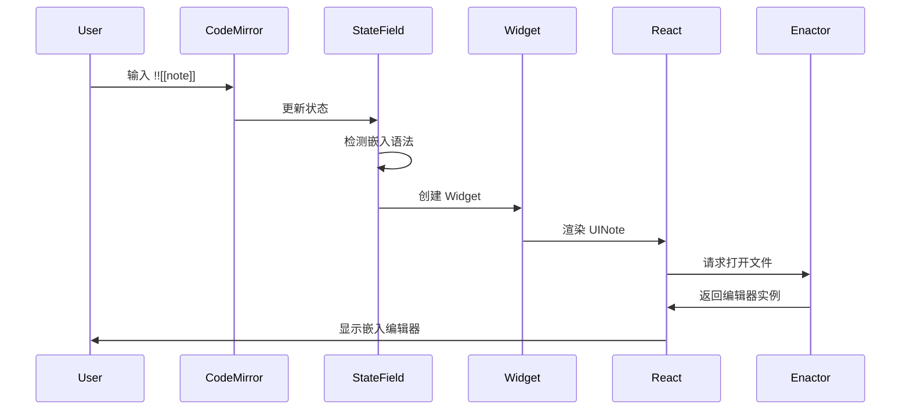

# Flow Editor (内联编辑嵌入块) 技术详解

*作者：Block Link Plus 技术团队*  
*日期：2024-12-28*  
*版本：1.3.3*

本文档为具有 C 语言背景但不熟悉 JavaScript/TypeScript 和 Obsidian 的开发者提供 Flow Editor 功能的详细技术解释。

---

## 目录

1. [概述](#概述)
2. [核心概念解释](#核心概念解释)
3. [系统架构](#系统架构)
4. [工作流程详解](#工作流程详解)
5. [关键组件分析](#关键组件分析)
6. [渲染机制](#渲染机制)
7. [状态管理](#状态管理)
8. [CSS 样式系统](#css-样式系统)
9. [模式差异处理](#模式差异处理)
10. [调试指南](#调试指南)

---

## 概述

Flow Editor 是一个允许用户在当前文档中直接编辑嵌入内容的功能。它支持两种格式：

1. **`!![[文件名]]`** - 可编辑的嵌入块
2. **`![[文件名#^block-id]]`** - 只读的嵌入块（包括多行块）

### 基本工作原理

```
用户输入 !![[note]] → CodeMirror 检测 → 创建编辑器装饰 → 渲染嵌入内容 → 允许原地编辑
```

---

## 核心概念解释

### 1. CodeMirror (CM)

CodeMirror 是 Obsidian 使用的代码编辑器库。可以将其理解为一个高级的文本编辑器引擎。

**类比 C 语言**：
```c
// C 语言中的文本缓冲区
typedef struct {
    char* buffer;      // 文本内容
    int cursor_pos;    // 光标位置
    int selection_start;
    int selection_end;
} TextEditor;

// CodeMirror 相当于
class EditorView {
    state: EditorState;     // 编辑器状态
    dom: HTMLElement;       // DOM 元素
    dispatch(transaction);  // 更新状态
}
```

### 2. StateField（状态字段）

StateField 是 CodeMirror 中存储和管理状态的机制。

**类比 C 语言**：
```c
// C 语言中的全局状态
struct EditorGlobals {
    FlowEditorInfo* flow_editors;  // 所有嵌入编辑器信息
    int flow_editor_count;
};

// TypeScript 中的 StateField
const flowEditorInfo = StateField.define<FlowEditorInfo[]>({
    create() { return []; },
    update(value, transaction) { /* 更新逻辑 */ }
});
```

### 3. Widget（小部件）

Widget 是 CodeMirror 中用于在文本中插入自定义 DOM 元素的机制。

**类比 C 语言**：
```c
// C 语言中的插件系统
typedef struct {
    void* (*create_dom)();      // 创建 DOM 的函数指针
    void (*destroy)(void* dom); // 销毁 DOM 的函数指针
    int (*compare)(void* a, void* b); // 比较函数
} WidgetVTable;
```

### 4. React 组件

React 是用于构建用户界面的 JavaScript 库。组件是可重用的 UI 单元。

**类比 C 语言**：
```c
// C 语言中的 UI 函数
void render_note_view(NoteViewProps* props) {
    // 创建 UI 元素
    Element* div = create_element("div");
    // 设置属性
    set_class(div, "mk-flowspace-editor");
    // 渲染内容
    if (props->load) {
        load_path(props->path);
    }
}

// React 组件
const UINote = (props: NoteViewProps) => {
    return <div className="mk-flowspace-editor">...</div>;
};
```

---

## 系统架构

### 整体架构图

```mermaid
graph TB
    A[用户输入 !![[note]]] --> B[CodeMirror 检测]
    B --> C[flowEditorInfo StateField]
    C --> D[创建 FlowEditorInfo 对象]
    D --> E[FlowEditorWidget]
    E --> F[UINote React 组件]
    F --> G[Enactor 打开文件]
    G --> H[渲染嵌入内容]
    
    I[Markdown 后处理器] --> J[处理已渲染的 DOM]
    J --> K[添加编辑按钮]
    
    L[CSS 样式] --> M[视觉效果]
```

### 主要模块

1. **FlowEditorManager** (`src/features/flow-editor/index.ts`)
   - 总控制器，管理整个 Flow Editor 功能
   - 初始化、设置、注册处理器

2. **CodeMirror 扩展** (`src/basics/codemirror/flowEditor.tsx`)
   - StateField：存储嵌入编辑器信息
   - Widget：创建编辑器 UI
   - 装饰器：替换文本为编辑器

3. **UI 组件** (`src/basics/ui/UINote.tsx`)
   - React 组件，渲染嵌入内容
   - 处理只读和可编辑模式

4. **Markdown 后处理器** (`src/basics/flow/markdownPost.tsx`)
   - 处理已渲染的嵌入块
   - 添加编辑图标和交互

5. **Enactor** (`src/basics/enactor/obsidian.tsx`)
   - 文件系统抽象层
   - 处理路径解析和文件打开

---

## 工作流程详解

### 1. 初始化阶段

```typescript
// FlowEditorManager.initialize()
1. 加载 Enactor
2. 如果启用了 editorFlow：
   a. 修补 Workspace（patchWorkspaceForFlow）
   b. 修补 WorkspaceLeaf（patchWorkspaceLeafForFlow）
   c. 添加 CSS 类（mk-flow-replace, mk-flow-minimal/seamless）
   d. 注册 Markdown 后处理器
   e. 注册 CodeMirror 扩展
```

### 2. 文本检测阶段

当用户输入 `!![[note]]` 时：

```typescript
// flowEditorInfo StateField 的 update 方法
1. 扫描整个文档文本
2. 使用正则表达式匹配：
   - /!!\[\[([^\]]+)\]\]/g  → 可编辑嵌入
   - /(?<!!)!\[\[([^\]]+)\]\]/g → 只读嵌入（多行块）
3. 为每个匹配创建 FlowEditorInfo 对象：
   {
     id: 唯一标识符,
     link: "note",
     from: 开始位置,
     to: 结束位置,
     type: 嵌入类型,
     height: 高度（像素）,
     expandedState: 展开状态（0=关闭, 1=自动打开, 2=打开）
   }
```

### 3. 渲染阶段

```typescript
// FlowEditorWidget.toDOM()
1. 创建容器 div
2. 设置 ID 和高度
3. 创建 React 根节点
4. 渲染 UINote 组件：
   <UINote
     load={true}
     plugin={plugin}
     path={link}
     source={当前文件路径}
     isReadOnly={是否只读}
   />
```

### 4. 内容加载阶段

```typescript
// UINote 组件
1. 解析路径（通过 Enactor）
2. 检查文件是否存在
3. 如果是只读模式：
   a. 读取文件内容
   b. 提取指定块的内容
   c. 使用 MarkdownRenderer 渲染
4. 如果是编辑模式：
   a. 调用 Enactor.openPath()
   b. 在容器中创建新的编辑器实例
```

### 5. 交互处理阶段

```typescript
// FlowEditorHover 组件
1. 渲染编辑/查看切换按钮
2. 点击时修改文档：
   - 添加 "!" 切换到只读模式
   - 删除 "!" 切换到编辑模式
```

---

## 关键组件分析

### 1. FlowEditorInfo 数据结构

```typescript
interface FlowEditorInfo {
  id: string;                    // 唯一标识符
  link: string;                  // 链接文本，如 "note#^block"
  from: number;                  // 文本开始位置
  to: number;                    // 文本结束位置
  type: FlowEditorLinkType;      // 类型（Link/Embed/ReadOnlyEmbed）
  height: number;                // 渲染高度（-1 表示自动）
  expandedState: FlowEditorState;// 展开状态
}
```

**C 语言等价**：
```c
typedef enum {
    LINK = 0,
    EMBED = 1,
    EMBED_CLOSED = 2,
    READONLY_EMBED = 3
} FlowEditorLinkType;

typedef struct {
    char id[32];
    char* link;
    int from;
    int to;
    FlowEditorLinkType type;
    int height;
    int expanded_state;
} FlowEditorInfo;
```

### 2. FlowEditorWidget 类

这是 CodeMirror 的 Widget 实现，负责创建实际的 DOM 元素。

```typescript
class FlowEditorWidget extends WidgetType {
  toDOM(view: EditorView) {
    // 创建容器
    const div = document.createElement("div");
    div.classList.add("mk-floweditor-container");
    
    // 渲染 React 组件
    this.root = createRoot(div);
    this.root.render(<UINote ... />);
    
    return div;
  }
  
  destroy(dom: HTMLElement) {
    // 清理 React 组件
    if (this.root) this.root.unmount();
  }
}
```

### 3. UINote 组件

这是核心的 React 组件，处理实际的内容渲染。

```typescript
export const UINote = (props: NoteViewProps) => {
  const [loaded, setLoaded] = useState(false);
  const flowRef = useRef<HTMLDivElement>(null);
  
  const loadPath = async () => {
    if (props.isReadOnly) {
      // 只读模式：渲染静态内容
      // 1. 读取文件
      // 2. 提取块内容
      // 3. 渲染 Markdown
    } else {
      // 编辑模式：创建嵌入编辑器
      plugin.enactor.openPath(filePath, div);
    }
  };
  
  return <div ref={flowRef} className="mk-flowspace-editor" />;
};
```

---

## 渲染机制

### 1. CodeMirror 装饰器系统

装饰器（Decoration）是 CodeMirror 用来修改文本显示的机制。

```typescript
// 创建装饰器
const flowEditorRangeset = (state: EditorState) => {
  const builder = new RangeSetBuilder<Decoration>();
  
  for (const info of flowEditorInfos) {
    if (info.expandedState === FlowEditorState.Open) {
      // 替换文本为 Widget
      builder.add(
        info.from,
        info.to,
        Decoration.replace({
          widget: new FlowEditorWidget(info),
          inclusive: true,
          block: false
        })
      );
    }
  }
  
  return builder.finish();
};
```

### 2. 渲染流程



### 3. 双重渲染问题

对于 `![[file#^block]]` 格式，存在三个渲染系统：

1. **Obsidian 原生渲染** - 创建只读嵌入
2. **CodeMirror 装饰器** - 替换为可编辑版本
3. **Markdown 后处理器** - 添加编辑按钮

这导致了渲染冲突，需要仔细协调。

---

## 状态管理

### 1. StateField 链

```typescript
// 主要的 StateField
1. flowEditorInfo - 存储所有嵌入编辑器信息
2. flowTypeStateField - 当前编辑器类型（doc/flow/context）
3. flowIDStateField - 当前活动的编辑器 ID
```

### 2. 状态更新流程

```typescript
// 用户点击编辑按钮
1. FlowEditorHover.toggleFlow()
2. 发送 CodeMirror transaction：
   view.dispatch({
     changes: { from: pos, to: pos, insert: "!" }
   })
3. 触发 flowEditorInfo 更新
4. 重新计算装饰器
5. 更新 UI
```

### 3. 高度缓存机制

```typescript
// 缓存编辑器高度以避免跳动
const cacheFlowEditorHeight = Annotation.define<[id: string, height: number]>();

// 在视图更新时缓存高度
if (v.heightChanged) {
  cm.dispatch({
    annotations: cacheFlowEditorHeight.of([flowID, v.view.contentHeight])
  });
}
```

---

## CSS 样式系统

### 1. 样式层级

```css
/* 基础容器样式 */
.mk-floweditor-container {
  display: inline-block;
  width: 100%;
  min-height: var(--flow-height);
}

/* 编辑器选择器（编辑按钮） */
.mk-floweditor-selector {
  position: absolute;
  right: 0px;
  top: -34px;
  visibility: hidden;
}

/* 悬停时显示 */
.cm-line:hover > .mk-floweditor-selector {
  visibility: visible;
}

/* 样式模式 */
.mk-flow-minimal .internal-embed {
  border: thin solid var(--mk-ui-divider);
  border-radius: 4px;
  padding: 8px;
}

.mk-flow-seamless .internal-embed {
  /* 无边框，融入文档 */
}
```

### 2. 样式模式

- **Minimal（最小化）** - 带边框和内边距，视觉上独立
- **Seamless（无缝）** - 无边框，融入周围文本

### 3. 响应式设计

```css
/* 移动端隐藏某些控件 */
body.is-mobile .mk-floweditor-selector {
  display: none;
}

/* 只读嵌入的特殊定位 */
.internal-embed.markdown-embed {
  position: relative;
}

.internal-embed.markdown-embed .mk-floweditor-selector {
  position: absolute;
  right: 8px;
  top: 8px;
}
```

---

## 模式差异处理

### 1. 三种视图模式

1. **源码模式（Source）** - 显示原始 Markdown
2. **实时预览（Live Preview）** - 混合渲染和源码
3. **阅读模式（Reading）** - 完全渲染

### 2. 模式检测

```typescript
// 检测当前模式
const view = app.workspace.activeLeaf?.view;
const mode = view.getMode(); // 'source' 或 'preview'

// 检测是否为实时预览
const isLivePreview = view.editor.cm.state.field(editorLivePreviewField, false);
```

### 3. 模式特定处理

```typescript
// Markdown 后处理器中
if (view.getMode() === 'preview') {
  return; // 阅读模式不处理
}

if (!isLivePreview) {
  return; // 源码模式不处理
}

// 只在实时预览模式下处理
processEmbeddedBlocks(element);
```

---

## 调试指南

### 1. 常见问题定位

**问题：嵌入块不显示**
```javascript
// 检查点
1. console.log('Flow Editor enabled:', plugin.settings.editorFlow);
2. console.log('StateField values:', cm.state.field(flowEditorInfo));
3. console.log('Widget created:', document.querySelector('.mk-floweditor-container'));
```

**问题：渲染重复**
```javascript
// 检查是否有多个处理器
1. 检查 CodeMirror 装饰器
2. 检查 Markdown 后处理器
3. 检查原生 Obsidian 渲染
```

### 2. 开发工具使用

```javascript
// 在控制台中调试
// 获取当前编辑器
const cm = app.workspace.activeLeaf.view.editor.cm;

// 查看 StateField
const infos = cm.state.field(flowEditorInfo);
console.table(infos);

// 手动触发更新
cm.dispatch({
  annotations: toggleFlowEditor.of(['editor-id', 2])
});
```

### 3. 性能分析

```javascript
// 测量渲染时间
console.time('flow-editor-render');
loadPath();
console.timeEnd('flow-editor-render');

// 监控内存使用
const observer = new PerformanceObserver((list) => {
  for (const entry of list.getEntries()) {
    console.log(entry);
  }
});
observer.observe({ entryTypes: ['measure'] });
```

---

## 多行块实现细节

### 1. 格式规范

多行块使用特殊格式：`#^xyz-xyz`，其中 `xyz` 是相同的字母数字组合。

```typescript
// 检测多行块
const multiLineBlockRegex = /#\^([a-z0-9]+)-\1$/;

// 示例
"![[file#^abc-abc]]" // 多行块
"![[file#^abc]]"     // 单行块
```

### 2. 渲染差异

```typescript
// 只读多行块的特殊处理
if (props.isReadOnly && multiLineBlockRegex.test(blockId)) {
  // 1. 解析起始和结束块 ID
  const [startId, endId] = blockId.split('-');
  
  // 2. 获取行范围
  const startLine = getBlockLine(startId);
  const endLine = getBlockLine(endId);
  
  // 3. 提取并渲染内容
  const content = lines.slice(startLine, endLine + 1).join('\n');
  MarkdownRenderer.renderMarkdown(content, container, path, plugin);
}
```

### 3. 当前问题

多行块渲染存在以下挑战：

1. **双重渲染** - CodeMirror 和后处理器都在处理
2. **原生支持不完整** - Obsidian 不理解 `#^xyz-xyz` 格式
3. **装饰器限制** - ReadOnlyEmbed 类型的特殊行为

---

## 总结

Flow Editor 是一个复杂的系统，涉及多个层次的交互：

1. **文本层** - CodeMirror 管理文本和编辑器状态
2. **UI 层** - React 组件提供用户界面
3. **样式层** - CSS 提供视觉效果
4. **集成层** - 与 Obsidian API 的交互

理解这个系统需要掌握：
- CodeMirror 的状态管理和装饰器系统
- React 的组件生命周期
- Obsidian 的插件 API
- 异步编程和事件处理

对于 C 语言背景的开发者，可以将其理解为一个事件驱动的插件系统，其中：
- StateField 相当于全局状态
- Widget 相当于 UI 插件
- React 组件相当于 UI 渲染函数
- CSS 相当于 UI 主题配置

---

## 附录：关键 API 参考

### CodeMirror API
- `StateField.define()` - 定义状态字段
- `Decoration.replace()` - 替换文本装饰
- `EditorView.dispatch()` - 发送状态更新

### Obsidian API
- `Plugin.registerMarkdownPostProcessor()` - 注册 Markdown 处理器
- `Plugin.registerEditorExtension()` - 注册编辑器扩展
- `Workspace.getLeaf()` - 获取编辑器叶子

### React API
- `createRoot()` - 创建 React 根节点
- `useState()` - 状态钩子
- `useEffect()` - 副作用钩子 