# σ₂: System Patterns
*v1.0 | Created: 2024-12-19 | Updated: 2024-12-25*
*Π: DEVELOPMENT | Ω: EXECUTE*

> Status (2026-02 / v2.0.0): Parts of this document describe removed 1.x-era capabilities (Timeline / Time Section / vendored vslinko). Treat those sections as historical reference only. For current behavior, prefer `openspec/specs/*` and the code under `src/features/file-outliner-view`.

## 🏛️ Architecture Overview

### 系统架构
插件采用模块化架构，将功能分解为独立的模块，每个模块负责特定的功能。这种架构提高了代码的可维护性和可测试性。

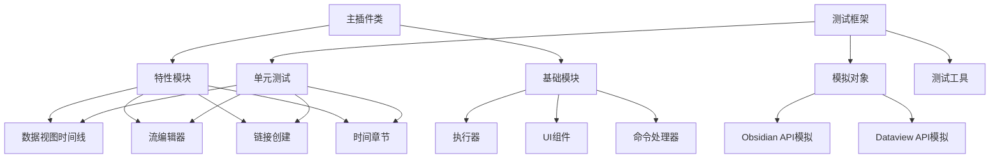

### 模块职责
- **主插件类**: 负责初始化和协调各个功能模块
- **特性模块**: 实现插件的主要功能
- **基础模块**: 提供基础功能，如执行器、UI 组件等
- **测试框架**: 提供测试支持，包括单元测试、模拟对象和测试工具

## 🧩 Core Components

### 模块组织
```
src/
├── features/              # 特性模块
│   ├── dataview-timeline/ # 数据视图时间线功能
│   ├── flow-editor/       # 流编辑器功能
│   ├── link-creation/     # 链接创建功能
│   └── time-section/      # 时间章节功能
├── basics/                # 基础模块
│   ├── enactor/           # 执行器
│   ├── ui/                # UI 组件
│   └── ...                # 其他基础功能
├── test-utils/            # 测试工具
│   ├── createMockDataviewApi.ts
│   ├── createMockFile.ts
│   └── createMockPlugin.ts
└── main.ts                # 主入口点
```

### 特性模块
每个特性模块都是独立的，负责特定的功能。这种模块化设计使得每个模块可以独立开发、测试和维护。

#### 数据视图时间线模块
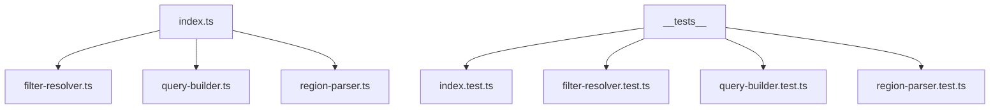

- **index.ts**: 模块的主入口点，协调其他组件
- **filter-resolver.ts**: 解析过滤器配置，包括标签和链接
- **query-builder.ts**: 构建和执行查询
- **region-parser.ts**: 解析文件中的时间线区域

#### 流编辑器模块
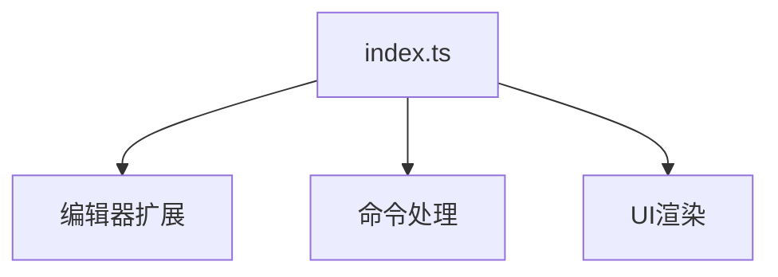

- **index.ts**: 模块的主入口点，协调编辑器扩展、命令处理和 UI 渲染

### 基础模块
基础模块提供通用功能，被特性模块使用。

#### 执行器
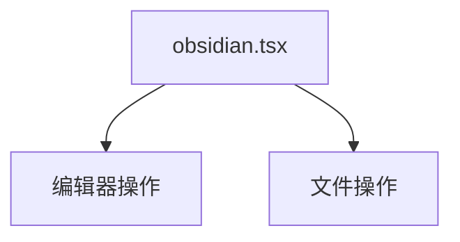

- **obsidian.tsx**: 提供与 Obsidian API 交互的功能

#### UI 组件
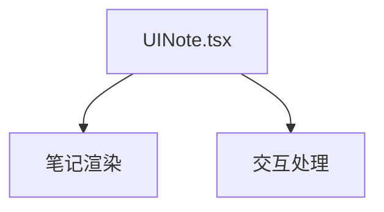

- **UINote.tsx**: 提供 UI 组件和交互功能

## 🧪 Testing Architecture

### 测试框架结构
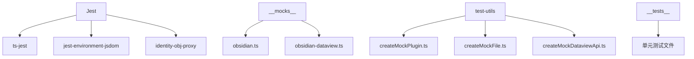

- **Jest**: 测试运行器和断言库
- **ts-jest**: TypeScript 预处理器
- **jest-environment-jsdom**: 浏览器环境模拟
- **identity-obj-proxy**: CSS 模块模拟
- **__mocks__**: 模拟对象目录
- **test-utils**: 测试工具目录
- **__tests__**: 测试文件目录

### 模拟对象
模拟对象用于替代测试中的外部依赖，使测试可以在没有实际依赖的情况下运行。

#### Obsidian API 模拟
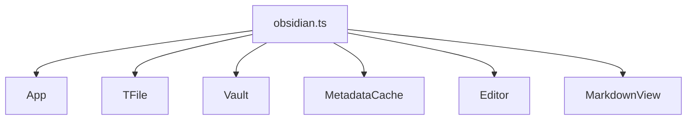

- **App**: 模拟 Obsidian 应用程序
- **TFile**: 模拟文件对象
- **Vault**: 模拟文件库
- **MetadataCache**: 模拟元数据缓存
- **Editor**: 模拟编辑器
- **MarkdownView**: 模拟 Markdown 视图

#### Dataview API 模拟
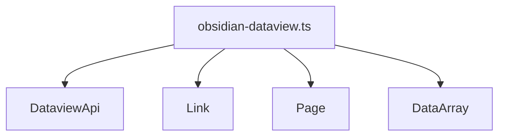

- **DataviewApi**: 模拟 Dataview API
- **Link**: 模拟链接对象
- **Page**: 模拟页面对象
- **DataArray**: 模拟数据数组

### 测试工具
测试工具提供辅助函数，简化测试代码。

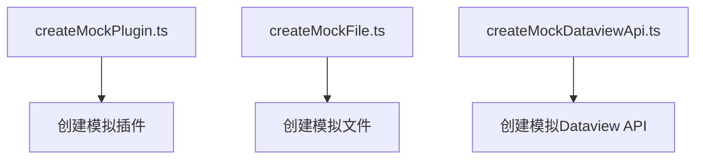

- **createMockPlugin.ts**: 创建模拟插件实例
- **createMockFile.ts**: 创建模拟文件和元数据
- **createMockDataviewApi.ts**: 创建模拟 Dataview API

## 🔄 Data Flow

### 命令处理流程
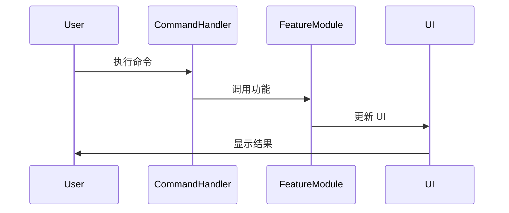

### 时间线生成流程
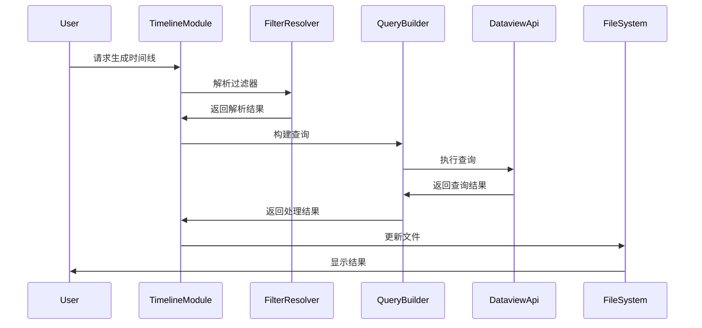

### 测试执行流程
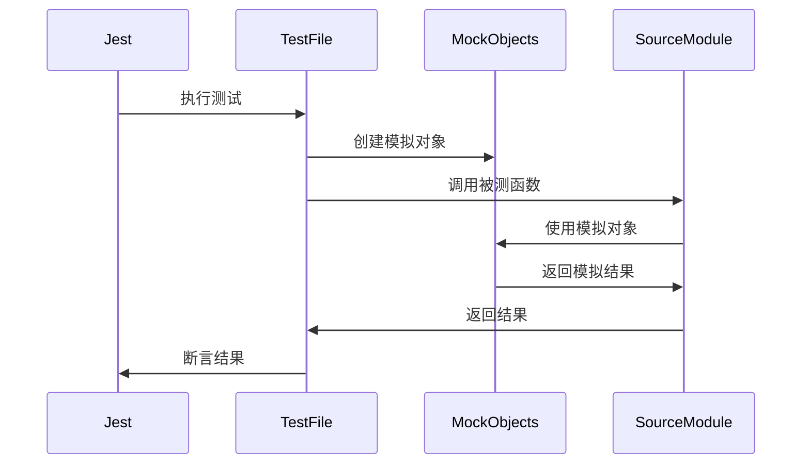

## 🧠 Design Patterns

### 模块化模式
将功能分解为独立的模块，每个模块负责特定的功能。这种模式提高了代码的可维护性和可测试性。

```typescript
// 模块化示例
export class DataviewTimelineModule {
  constructor(private app: App, private dataviewApi: DataviewApi) {}
  
  // 模块方法
  public async generateTimeline(config: TimelineConfig): Promise<void> {
    // 实现时间线生成逻辑
  }
}
```

### 依赖注入模式
通过构造函数或参数传递依赖，减少模块之间的耦合。这种模式提高了代码的可测试性。

```typescript
// 依赖注入示例
export class FilterResolver {
  constructor(private app: App) {}
  
  // 解析过滤器
  public resolveTags(context: TimelineContext): string[] {
    // 实现标签解析逻辑
  }
}
```

### 测试驱动开发模式
先编写测试，再实现功能。这种模式确保代码的可测试性和正确性。

```typescript
// 测试驱动开发示例
describe('resolveTags', () => {
  test('应该返回空数组，当没有配置标签过滤器时', () => {
    const context = createMockContext();
    const result = resolveTags(context);
    expect(result).toEqual([]);
  });
});
```

### 模拟对象模式
创建模拟对象替代测试中的外部依赖。这种模式使测试可以在没有实际依赖的情况下运行。

```typescript
// 模拟对象示例
export class MockDataviewApi implements DataviewApi {
  query(queryString: string): { successful: boolean; value: any } {
    return {
      successful: true,
      value: []
    };
  }
}
```

## 🔌 Integration Points

### Obsidian API 集成
插件通过 Obsidian API 与 Obsidian 集成，提供功能扩展。

```typescript
// Obsidian API 集成示例
export default class BlockLinkPlusPlugin extends Plugin {
  async onload() {
    // 注册命令
    this.addCommand({
      id: 'create-block-link',
      name: 'Create Block Link',
      callback: () => this.createBlockLink()
    });
    
    // 注册编辑器扩展
    this.registerEditorExtension([
      // 编辑器扩展配置
    ]);
  }
}
```

### Dataview API 集成
插件通过 Dataview API 与 Dataview 插件集成，提供高级查询功能。

```typescript
// Dataview API 集成示例
export async function executeTimelineQuery(
  context: TimelineContext,
  resolvedLinks: Link[],
  resolvedTags: string[]
): Promise<any> {
  // 构建查询
  const query = `
    TABLE file.cday AS "Created"
    FROM ${sourceFoldersClause}
    WHERE ${whereClause}
    SORT file.cday ${sortOrder}
  `;
  
  // 执行查询
  const result = await context.dataviewApi.query(query);
  
  return result.successful ? result.value : { values: [] };
}
```

### 测试框架集成
插件通过 Jest 与测试框架集成，提供测试支持。

```typescript
// Jest 配置示例
module.exports = {
  preset: 'ts-jest',
  testEnvironment: 'jsdom',
  moduleNameMapper: {
    '\\.css$': 'identity-obj-proxy',
  },
  setupFilesAfterEnv: ['./jest.setup.js'],
  transform: {
    '^.+\\.tsx?$': [
      'ts-jest',
      {
        tsconfig: 'tsconfig.test.json',
      },
    ],
  },
  moduleFileExtensions: ['ts', 'tsx', 'js', 'jsx', 'json', 'node'],
};
```

## 📊 Performance Considerations

### 查询优化
优化查询以提高性能，减少查询时间。

```typescript
// 查询优化示例
export async function executeTimelineQuery(
  context: TimelineContext,
  resolvedLinks: Link[],
  resolvedTags: string[]
): Promise<any> {
  // 构建优化的查询
  const query = `
    TABLE file.cday AS "Created"
    FROM ${sourceFoldersClause}
    WHERE ${whereClause}
    SORT file.cday ${sortOrder}
    LIMIT 100
  `;
  
  // 执行查询
  const result = await context.dataviewApi.query(query);
  
  return result.successful ? result.value : { values: [] };
}
```

### 缓存策略
使用缓存减少重复计算，提高性能。

```typescript
// 缓存策略示例
const cache = new Map<string, any>();

export function getCachedResult(key: string, compute: () => any): any {
  if (cache.has(key)) {
    return cache.get(key);
  }
  
  const result = compute();
  cache.set(key, result);
  return result;
}
```

### 测试性能
测试框架配置以提高测试性能。

```typescript
// Jest 性能优化配置
module.exports = {
  // 其他配置...
  maxWorkers: '50%', // 限制并行工作进程数
  bail: true, // 在第一个失败后停止
  verbose: false, // 减少输出
};
```

## 🔒 Security Considerations

### 文件操作安全
确保文件操作安全，防止数据丢失。

```typescript
// 文件操作安全示例
export async function updateFile(file: TFile, content: string): Promise<void> {
  try {
    // 备份原始内容
    const originalContent = await this.app.vault.read(file);
    
    // 更新文件
    await this.app.vault.modify(file, content);
  } catch (error) {
    console.error('Failed to update file:', error);
    // 恢复原始内容
    if (originalContent) {
      await this.app.vault.modify(file, originalContent);
    }
  }
}
```

### 错误处理
全面的错误处理，防止插件崩溃。

```typescript
// 错误处理示例
export async function executeTimelineQuery(
  context: TimelineContext,
  resolvedLinks: Link[],
  resolvedTags: string[]
): Promise<any> {
  try {
    // 执行查询
    const result = await context.dataviewApi.query(query);
    return result.successful ? result.value : { values: [] };
  } catch (error) {
    console.error('Failed to execute query:', error);
    return { values: [] };
  }
}
```

### 测试安全性
测试框架配置以确保测试安全性。

```typescript
// Jest 安全配置
module.exports = {
  // 其他配置...
  testTimeout: 5000, // 限制测试超时
  testPathIgnorePatterns: ['/node_modules/', '/dist/'], // 忽略特定路径
};
```

## 📝 Documentation Patterns

### 代码注释
使用 JSDoc 风格的注释提供文档。

```typescript
/**
 * 解析过滤器配置中的标签
 * @param context 时间线上下文
 * @returns 解析后的标签数组
 */
export function resolveTags(context: TimelineContext): string[] {
  // 实现标签解析逻辑
}
```

### 测试文档
在测试中提供清晰的描述和期望。

```typescript
describe('resolveTags', () => {
  test('应该返回空数组，当没有配置标签过滤器时', () => {
    // 测试实现
  });
  
  test('应该正确处理显式标签', () => {
    // 测试实现
  });
});
```

### 架构文档
使用 Mermaid 图表提供架构文档。

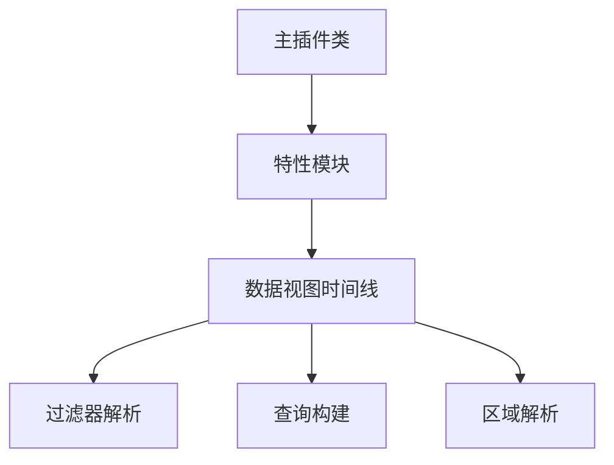

## 🚀 Deployment Patterns

### 构建流程
使用 esbuild 构建插件。

```javascript
// esbuild 配置示例
import esbuild from 'esbuild';
import process from 'process';
import builtins from 'builtin-modules';

const banner = `/*
THIS IS A GENERATED/BUNDLED FILE BY ESBUILD
*/
`;

const prod = process.argv[2] === 'production';

esbuild.build({
  banner: {
    js: banner,
  },
  entryPoints: ['src/main.ts'],
  bundle: true,
  external: [
    'obsidian',
    'electron',
    '@codemirror/autocomplete',
    '@codemirror/collab',
    '@codemirror/commands',
    '@codemirror/language',
    '@codemirror/lint',
    '@codemirror/search',
    '@codemirror/state',
    '@codemirror/view',
    '@lezer/common',
    '@lezer/highlight',
    '@lezer/lr',
    ...builtins,
  ],
  format: 'cjs',
  watch: !prod,
  target: 'es2018',
  logLevel: 'info',
  sourcemap: prod ? false : 'inline',
  treeShaking: true,
  outfile: 'main.js',
}).catch(() => process.exit(1));
```

### 测试流程
使用 Jest 运行测试。

```json
// package.json 测试脚本
{
  "scripts": {
    "test": "jest",
    "test:watch": "jest --watch",
    "test:coverage": "jest --coverage"
  }
}
```

### 版本管理
使用语义化版本控制。

```json
// manifest.json 版本
{
  "id": "obsidian-block-link-plus",
  "name": "Block Link Plus",
  "version": "1.3.3",
  "minAppVersion": "0.15.0",
  "description": "Enhanced block links with multi-line support, aliases, and more.",
  "author": "Your Name",
  "authorUrl": "https://github.com/yourusername",
  "isDesktopOnly": false
}
```

## 🔍 Error Handling Patterns

### 全局错误处理
使用全局错误处理器捕获未处理的错误。

```typescript
// 全局错误处理示例
export default class BlockLinkPlusPlugin extends Plugin {
  async onload() {
    // 注册全局错误处理器
    window.addEventListener('error', (event) => {
      console.error('Uncaught error:', event.error);
      // 处理错误
    });
    
    // 其他初始化逻辑
  }
}
```

### 测试错误处理
在测试中验证错误处理逻辑。

```typescript
// 测试错误处理示例
test('应该处理查询失败的情况', async () => {
  // 模拟查询失败
  mockDataviewApi.query = () => {
    return {
      successful: false,
      value: null,
      error: 'Query failed'
    };
  };
  
  const result = await executeTimelineQuery(mockContext, [], []);
  
  // 验证结果
  expect(result).toEqual({ values: [] });
});
```

## 🧩 Extension Points

### 插件扩展点
提供扩展点，允许其他插件或用户扩展功能。

```typescript
// 扩展点示例
export interface TimelineExtension {
  name: string;
  process: (sections: any[]) => any[];
}

export class TimelineManager {
  private extensions: TimelineExtension[] = [];
  
  // 注册扩展
  public registerExtension(extension: TimelineExtension): void {
    this.extensions.push(extension);
  }
  
  // 处理时间线
  public async processTimeline(sections: any[]): Promise<any[]> {
    let result = sections;
    
    // 应用扩展
    for (const extension of this.extensions) {
      result = extension.process(result);
    }
    
    return result;
  }
}
```

### 测试扩展点
测试扩展点的功能。

```typescript
// 测试扩展点示例
test('应该正确应用扩展', async () => {
  const manager = new TimelineManager();
  
  // 注册测试扩展
  manager.registerExtension({
    name: 'test-extension',
    process: (sections) => sections.map(s => ({ ...s, processed: true }))
  });
  
  const sections = [{ title: 'Test' }];
  const result = await manager.processTimeline(sections);
  
  // 验证结果
  expect(result).toEqual([{ title: 'Test', processed: true }]);
});
``` 
