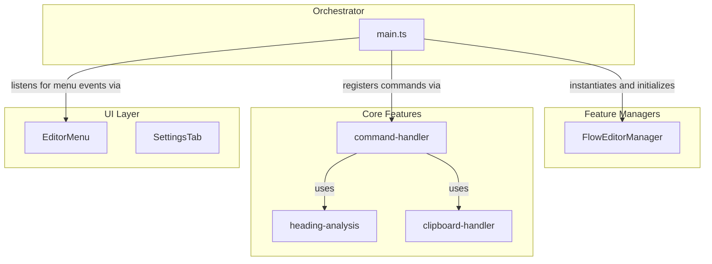

# σ₂: System Patterns
*v1.0 | Created: 2024-12-19 | Updated: {TODAY}*
*Π: DEVELOPMENT | Ω: EXECUTE*

## 🏛️ Architecture Overview

Block Link Plus has transitioned to a highly modular architecture centered around an **Orchestrator Pattern**. The `main.ts` file acts as the central orchestrator, delegating tasks to specialized, independent feature and UI modules. This design significantly improves maintainability, scalability, and testability.

### Core Architecture
- **Orchestrator (`main.ts`)**: Manages the plugin lifecycle and settings. It coordinates actions by delegating all business logic to specialized managers and modules, acting as a lightweight central hub.
- **`FlowEditorManager` (`src/features/flow-editor/`)**: A dedicated manager that encapsulates all logic related to the "Flow Editor" and "Basics" functionalities, including command creation, workspace patching, and editor lifecycle management.
- **Core Feature Modules (`src/features/`)**: Self-contained modules that encapsulate specific business logic.
  - **`heading-analysis.ts`**: Provides functions for analyzing document headings.
  - **`clipboard-handler.ts`**: Manages clipboard operations like copying links and generating aliases.
  - **`command-handler.ts`**: Contains the core logic for all registered plugin commands.
- **UI Modules (`src/ui/`)**: Components responsible for rendering and managing all user interface elements.
  - **`EditorMenu.ts`**: Manages the logic and event handling for the editor's right-click context menu.
  - **`SettingsTab.ts`**: Renders the plugin's settings panel.
- **Shared Code (`src/utils.ts`, `src/types.ts`)**: Common utilities and type definitions used across the application.

### 架构演进
The architecture has successfully evolved from a monolithic structure. `main.ts` has been significantly streamlined and no longer acts as a "God Object." A major refactoring was completed to extract all "Flow Editor" logic into a dedicated `FlowEditorManager`, further purifying `main.ts`'s role as an orchestrator.

## 🧩 System Components

### 核心组件
1. **`BlockLinkPlus` (Orchestrator)**: The main plugin class in `main.ts`.
2. **`FlowEditorManager`**: Manages the entire "Flow Editor" feature set.
3. **Core Feature Modules**:
   - `heading-analysis`, `clipboard-handler`, `command-handler`
4. **UI Modules**:
   - `EditorMenu`, `SettingsTab`, `ViewPlugin`

### 组件关系


## 🔀 Control Flow

### 主要流程
1. **插件初始化**:
   ```
   main.ts: onload() → loadSettings() → new FlowEditorManager().initialize() → setupUI() → registerCommands()
   ```

2. **命令执行 (Delegated)**:
   ```
   User Action → main.ts (Command Trigger) → delegates to command-handler.handle() → uses other modules (heading-analysis, clipboard-handler)
   ```
   
3. **右键菜单处理 (Delegated)**:
   ```
   Right-click Event → main.ts (Event Listener) → delegates to EditorMenu.handleEditorMenu() → delegates to command-handler
   ```

## 🧩 Architectural Refactoring Plan (Updated)

### 当前架构状态
The architecture is now highly modular. The extraction of the "Flow Editor" logic into its own manager (`FlowEditorManager`) represents a significant step towards the target architecture.

### 目标架构
A fully modular system with low coupling and high cohesion. `main.ts` should only be responsible for wiring together the different components of the plugin.

### 下一步重构策略
The most critical architectural refactoring is complete. Future work will focus on consolidation and quality improvement rather than major restructuring.

1.  **`main.ts` 遗留逻辑清理 (基本完成)**:
    -   **Status**: Mostly Complete.
    -   **Action Taken**: All "Flow Editor" logic and related utilities have been successfully extracted into `FlowEditorManager`. Additionally, dead legacy code related to menu handling was identified and removed.
    -   **Remaining**: Minor opportunities for cleanup may exist, such as extracting settings management, but this is now low priority.

2.  **测试体系建设 (Phase 4.3)**:
    -   **Priority**: High. This is the most critical next step.
    -   **Action**: Create dedicated unit and integration tests for the new modules (`FlowEditorManager`, `command-handler`, `EditorMenu`, etc.).
    -   **Goal**: Increase test coverage to ensure stability and prevent regressions, especially after the recent refactoring.

3.  **文档更新 (Phase 4.5)**:
    -   **Priority**: Medium.
    -   **Action**: Update this document (`systemPatterns.md`) and `techContext.md` to reflect the final architecture.
    -   **Goal**: Provide a clear and precise guide for future development and maintenance. 